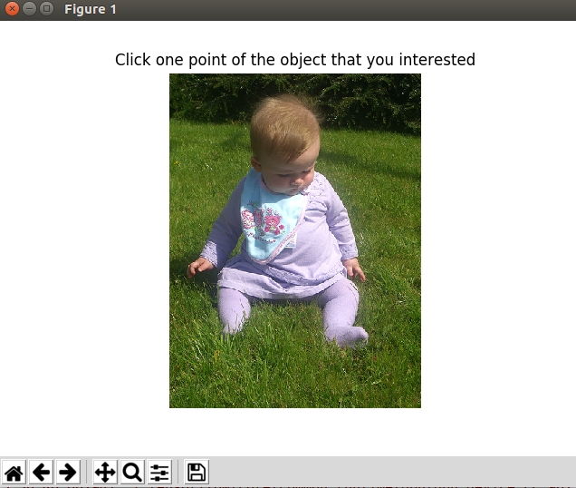
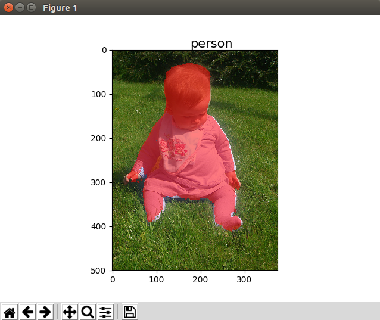

# Instance-Segment-BASI

# train

## train 1

0. pool size = 50

1. pos_weight=5 训练segment 100000

2. pos_weight=3 训练segment 350000

3. add attention class 0.1 * loss_classes 100000

4. add attention class 0.2 * loss_classes 200000

5. 同时训练 attention class 和 segment 230000

6. result in class,segment,together

## train 2

0. pool size = 90

1. pos_weight = 3 + attention class 0.2 * loss_classes 同时训练 attention class 和 segment 310000

2. result in begin/first

## train 3

0. pool size = 90

1. segment 3 类

2. result in begin/second

## train 4

0. segment border

1. segment 4 类

2. result in begin/third

# GUI

> BAISRunnerGUI.py

* 输入的三种方式：

    1. 图片路径
    2. 图片数据
    3. 网路路径

* 操作步骤
    1. click
    2. ok

* result

input | output
:-----:|:-----:
 | 

# Idea

1. 边界和attention的权重

2. 用一个小的对抗网络判断是否完成

3. 对给定点所在的对象分割和分类、给两个点判断是否属于一个对象、给定点判断是否属于前景

